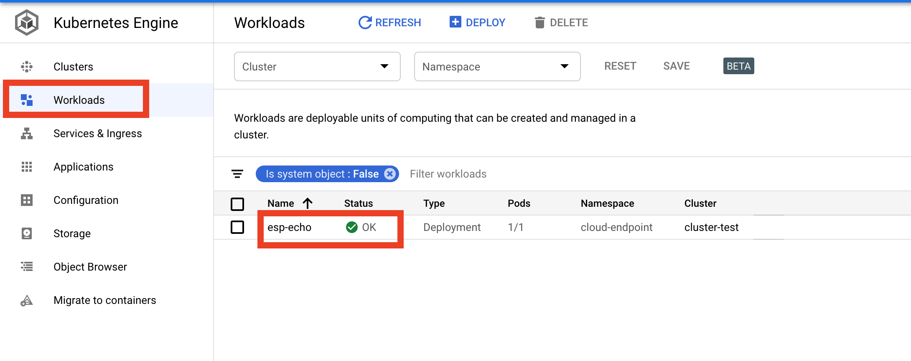

# CloudEndpoint y autentificacion JWT

Es un sistema de administración de API que proporciona funciones para ayudarlo a crear, mantener y proteger sus API


### Pre-requisitos 📋

- **Definir Contrato Openapi.yaml en version 2.0** 
- **Crear recursos GCP (IP EXTERNA, Cluster GKE y Service Accounts)**
- **Generar archivos k8s** 

### Contrato Openapi.yaml 🔧

```
swagger: "2.0"
info:
  description: "A simple Google Cloud Endpoints API example."
  title: "Endpoints Example Cloudendpoint"
  version: "1.0.0"
host: "DOMAIN_OPENAPI"
x-google-endpoints:
    - name: "DOMAIN_OPENAPI"
      target: "IP_RESERVADA"
consumes:
- "application/json"
produces:
- "application/json"
schemes:
- "https"
- "http"
securityDefinitions:
  apitoken:
    authorizationUrl: ""
    flow: "implicit"
    type: "oauth2"
    x-google-issuer: "SA_EMAIL_ADDRESS"
    x-google-jwks_uri: "https://www.googleapis.com/robot/v1/metadata/x509/SA_EMAIL_ADDRESS"
    x-google-audiences: "DOMAIN_OPENAPI"
security:
  - apitoken: []
paths:
  "/echo":
    post:
      description: "Echo back a given message."
      operationId: "echo"
      produces:
      - "application/json"
      responses:
        200:
          description: "Echo"
          schema:
            $ref: "#/definitions/echoMessage"
      parameters:
      - description: "Message to echo"
        in: body
        name: message
        required: true
        schema:
          $ref: "#/definitions/echoMessage"
  "/auth/info/googlejwt":
    get:
      description: "Returns the requests' authentication information."
      operationId: "auth_info_google_jwt"
      produces:
      - "application/json"
      responses:
        200:
          description: "Authentication info."
          schema:
            $ref: "#/definitions/authInfoResponse"

definitions:
  echoMessage:
    type: "object"
    properties:
      message:
        type: "string"
  authInfoResponse:
    properties:
      id:
        type: "string"
      email:
        type: "string"
```

| Variable| Descripcion |
| ------------- | ------------- |
| DOMAIN_OPENAPI | Dominio al cual sera asociado el contrato, se puede ocupar un dominio propio o uno generado por google.  |
| IP_RESERVADA| En la seccion target del contrato solo aplica si se utiliza el dominio de google. |
| SA_EMAIL_ADDRESS | Hace referencia a la cuenta de servicio la cual tiene permiso para acceder a los diferentes endpoint que la api exponga. |

Desplegar contrato openapi en cloud endpoint
```
gcloud config set project [PROJECT ID]
gcloud endpoints services deploy openapi-jwt.yaml
```
 

Contrato Desplegado

 

Path Contrato Desplegado

 

### Generar Ip externa ip-cloudendpoint de tipo Global en las opciones 

VPC NETWORK >> External IP Adressess >> Reserve static address

 

### Crear cluster GKE 

kubernetes Engine >> Cluster >> Create Cluster

 

## Crear Service Accounts

IAM & ADMIN >> Service Accounts >> Create Service Accounts


## Para este ejemplo se crearan 2 cuentas de servicios 

Se debe crear una cuenta de servicio para realizar la integración con el endpoint desplegado, para que tenga acceso al contrato.

El permiso que debe tener es el siguiente **Service Controller**

 
 
Se debe crear la segunda cuenta de permiso para que esta pueda solicitar token al recurso cloudendpoint con el permiso **Service Account Token Creator**

 

### Generar Archivos K8S  🔩

### Deployment 📦

```
# POD - API configuration (with Google Endpoints)
#apiVersion: extensions/v1beta1
apiVersion: apps/v1
kind: Deployment
metadata:
  # Normal services name
  name: esp-echo
spec:
  # Number of replicas
  replicas: 1
  strategy:
    type: RollingUpdate
    rollingUpdate:
      maxSurge: 50% # how many pods we can add at a time
      maxUnavailable: 50%
  selector:
    matchLabels:
      app: esp-echo
  template:
    metadata:
      labels:
        app: esp-echo
        tier: backend
    spec:
      volumes:
        - name: credentials
          secret:
            secretName: service-account-creds
      containers:
        - name: esp-echo
          image: gcr.io/endpoints-release/echo:latest
        - name: esp
          image: gcr.io/endpoints-release/endpoints-runtime:1
          args: [
            "--http_port=8080",
            "--backend=127.0.0.1:8081",
            "--service=echo-api.endpoints.arched-cabinet-288909.cloud.goog",
            "--rollout_strategy=managed",
            "-z=healthz",
            "--service_account_key=/secrets/cloud-endpoints/echo-cloudendpoint.json"]
          readinessProbe:
            httpGet:
              path: /healthz
              port: 8080
          ports:
            - containerPort: 8080
          volumeMounts:
            - name: credentials
              mountPath: /secrets/cloud-endpoints
              readOnly: true
```
En el despliegue se encontraran 2 componentes , el cliente de cloudendpoint y el componente con las caracteristicas desplegadas en el contrato openapi.

### Service 📦

```
apiVersion: v1
kind: Service
metadata:
  name: esp-echo-service
  annotations:
spec:
  ports:
    - name: http
      port: 80
      protocol: TCP
      targetPort: 8080
  selector:
    app: esp-echo
    tier: backend
  # LOCAL/INTERNAL: NodePort, GCP/EXTERNAL: LoadBalancer, ClusterIP
  type: NodePort
```

### Ingress 📦

```
apiVersion: extensions/v1beta1
kind: Ingress
metadata:
  name: "ingress"
  annotations:
    kubernetes.io/ingress.allow-http: "true"
    kubernetes.io/ingress.global-static-ip-name: "ip-cloudendpoint"
spec:
  rules:
  -  http:
      paths:
      - backend:
          serviceName: "esp-echo-service"
          servicePort: 80
        path: "/*"
```
Se genera el secrets con la cuenta de servicio para acceder al contrato desplegado en cloudendpoint.

```
kubectl create namespace cloud-endpoint
kubectl -n cloud-endpoint cloud-endpoint create secret generic service-account-creds --from-file=echo-cloudendpoint.json
```
Ya teniendo los archivos se realiza el despliegue de los componentes en el cluster GKE 
```
kubectl -n cloud-endpoint apply -f deployment.yaml
kubectl -n cloud-endpoint apply -f service.yaml
kubectl -n cloud-endpoint apply -f ingress.yaml
```

## Verificar servicios desplegados  📦

Cuando se realiza los despliegos se reflejera en la interfaz de gcp.

 


## Verificar logs servicios desplegados  📦

 

componente esp

 

componente esp echo

 

## Validar endpoint que expone el servicio 📦

Se puede utilizar la herramienta postma.

# Endpoint 1 
```
http://IP-EXTERNA/echo
```
 

# Endpoint 2 
```
http://IP-EXTERNA/auth/info/googlejwt
```
 

Al intentar consultar los diferentes endpoint , nos responde el servicio que no estamos autorizados 

 

## Generar Token con Firma JWT 📦

Para generar un token es necesaria la cuenta de servicio que se genero previamente con el permiso **Service Account Token Creator**. 

Firmar JWT
```
gcloud config set project [PROJECT ID]
```

Autentificar con cuenta de servicio generada
```
gcloud auth activate-service-account --key-file=[SERVICEACCOUNTJSON]
```


Generar file jwt.json
```
{
    "iss": "[EMAIL_SERVICEACCOUNT]",
    "iat": [TIEMPO_INICIO_TOKEN],
    "aud": "[SERVICE_NAME_CLOUDENDPOINT]",
    "exp": [TIEMPO_INICIO_EXPIRACION], 
    "sub": "[EMAIL_SERVICEACCOUNT]"
}
```

Firmar archivo jwt.json
```
gcloud beta iam service-accounts sign-jwt --iam-account [EMAIL_SERVICEACCOUNT] jwt.json signed-jwt.json
```

Nota : Se generara el archivo signed-jwt.json con el contenido del token.
Luego se puede agregar como metodo de autentificacion bearer Token a postman , para consultar servicio.

# Endpoint 1 
```
http://IP-EXTERNA/echo
```
 

# Endpoint 2 
```
http://IP-EXTERNA/auth/info/googlejwt
```
 
